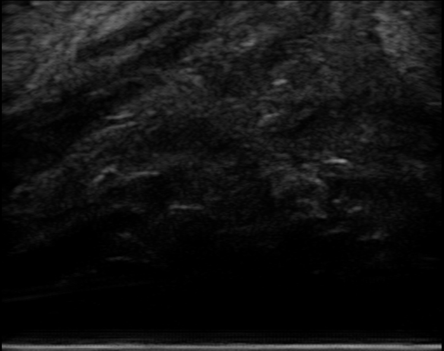
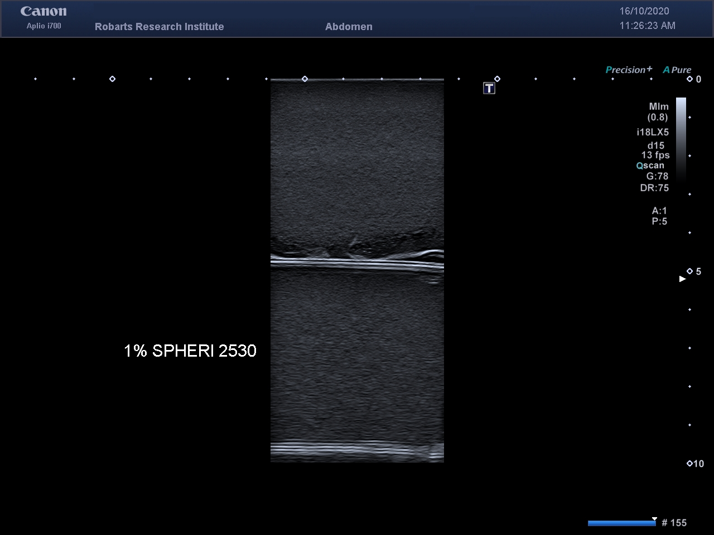
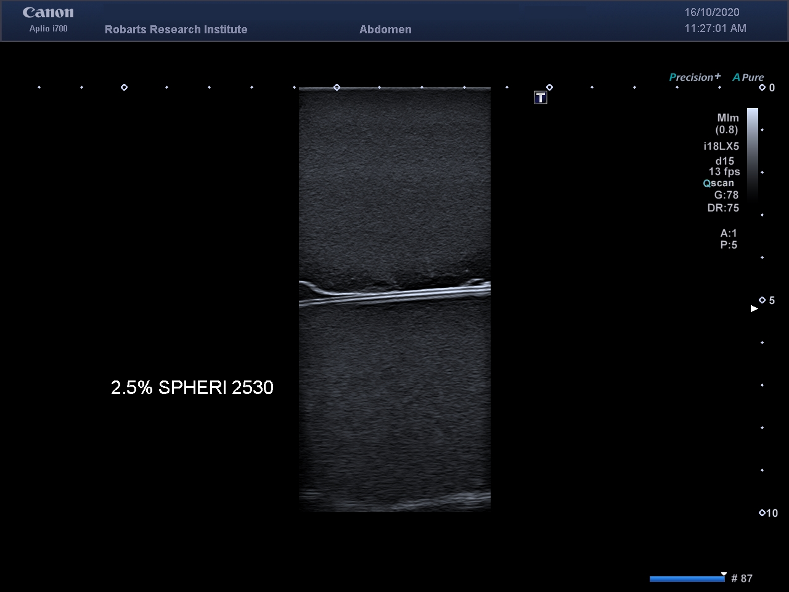
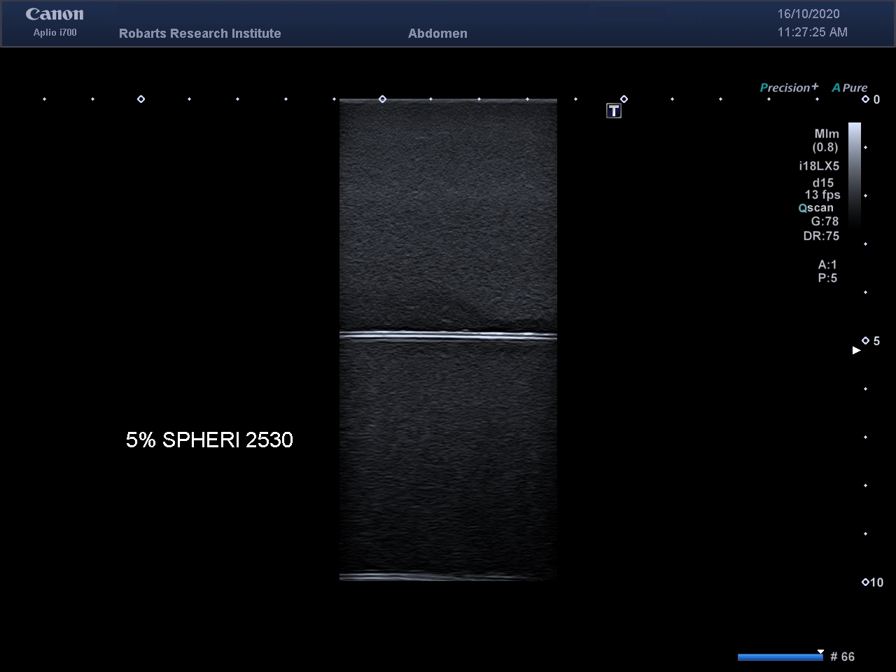
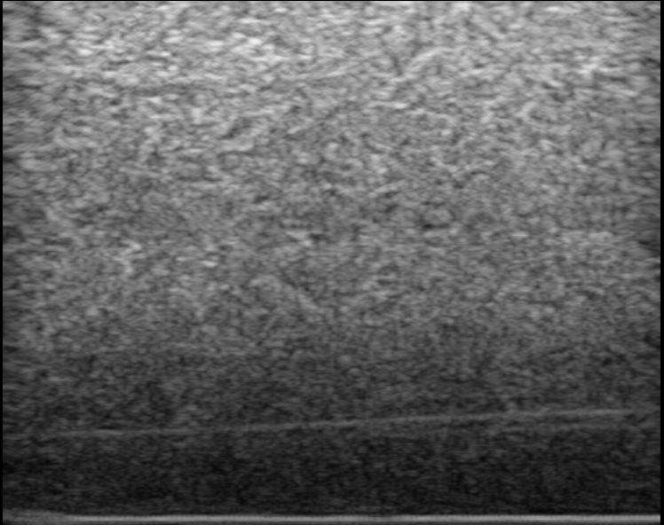
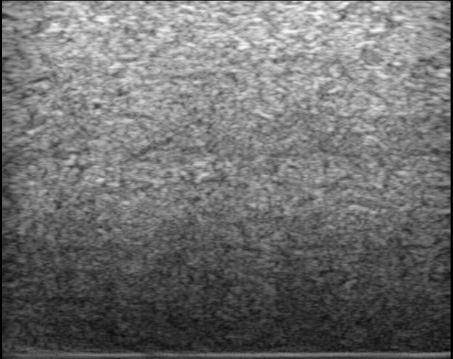
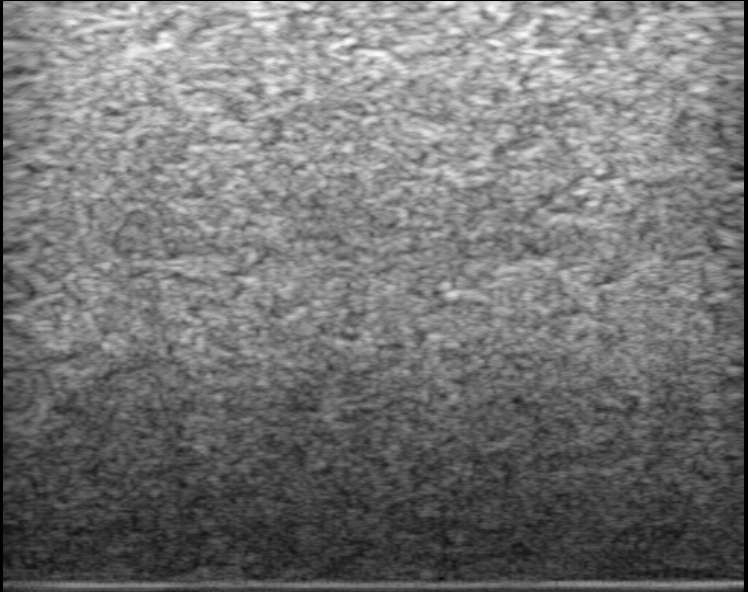
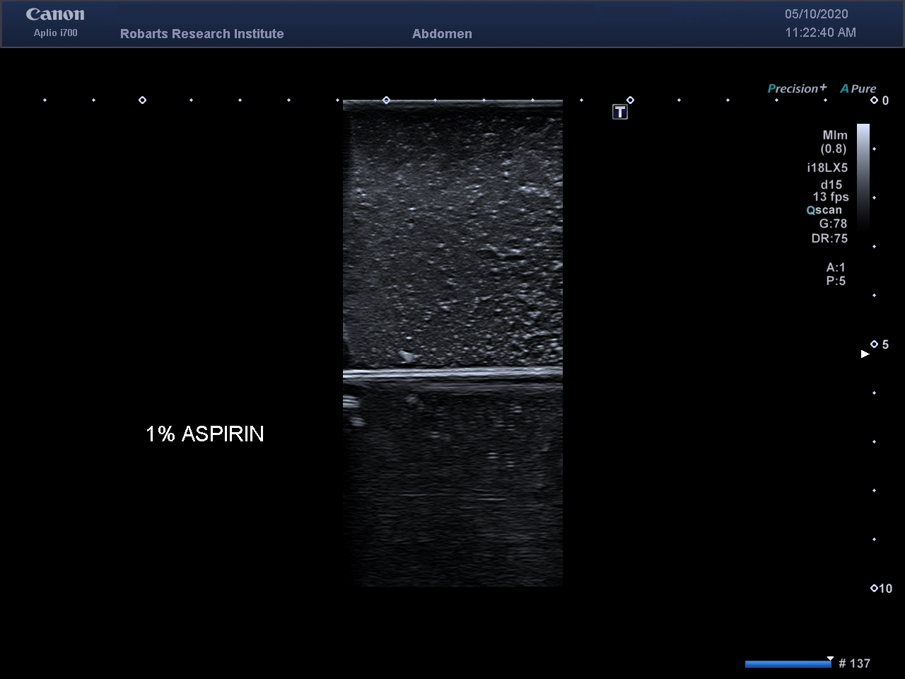
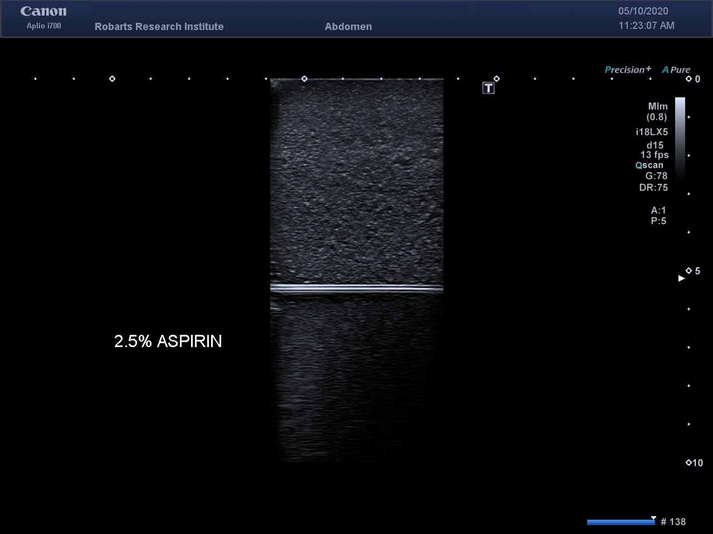
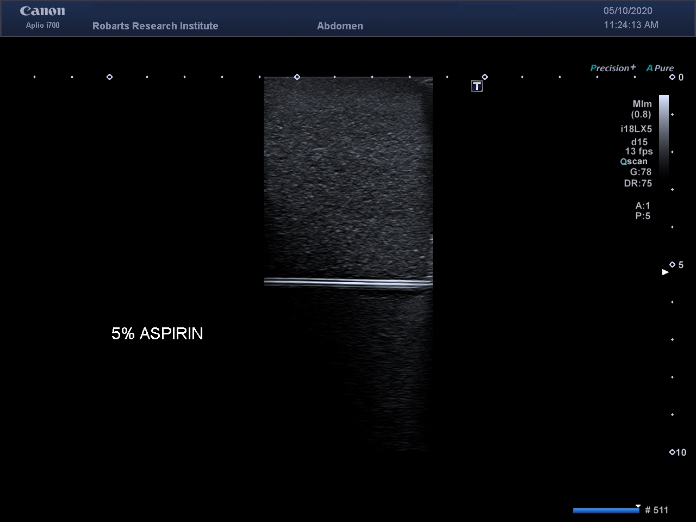

# PVAC Doping Agents Research Project

## Contributors
* Henry Bruin, Oakridge Secondary School
* Adam Rankin, Robarts Research Institute, Western University

## Overview
The purpose of this project is to research and analyze different possible doping agents for polyvinyl alcohol cryogel.

## Methods
Samples are created according to the following recipe:
1. x
1. y
1. z

## Results
A baseline image of pure PVAC is shown here as a reference.

### Spheriglass 2530
| 1% | 2.5% | 5% |
|:---:|:---:|:---:|
||||

### Spheriglass 3000
| 1% | 2.5% | 5% |
|:---:|:---:|:---:|
||||

### Aspirin
| 1% | 2.5% | 5% |
|:---:|:---:|:---:|
||||

#### Next Steps
* The next priority will be to start the process of making new phantoms to image. 
* A way to store the samples without mold growth is currently being researched
