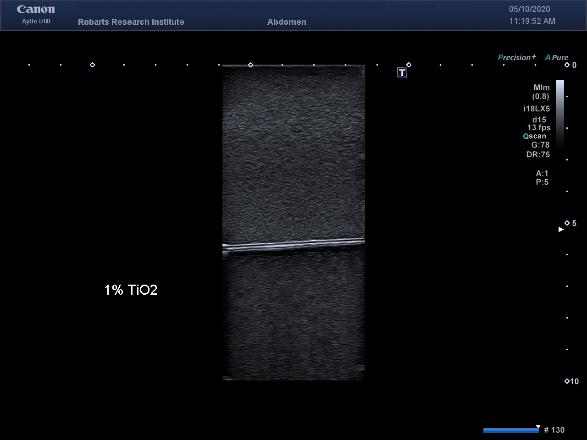

# PVAC Doping Agents Research Project

## Contributors
* Henry Bruin, Oakridge Secondary School
* Adam Rankin, Robarts Research Institute, Western University

## Overview
The purpose of this project is to research and analyze different possible doping agents for polyvinyl alcohol cryogel.

## Methods
Samples are created according to the following recipe:

**Set-up**
1. In the L-shaped lab, place retort stand in fume hood and mount motor. 
1. Check tthat it is off and RPM is at zero before proceeding.
1. Place heating mantle on Steadystir Analog base (rubber surface). Make sure the middle of the heating mantle is aligned with the Steadystir. 
1. Place 1000 mL glass beaker on stainless steel counter. Prepare the PVA mizture as discribed in "PVA mixture preparation" below. Place the beaker with PVA crystals/water mixture in the heating mantle. 
1. Place turbine through centre hole. Make sure turbine is approx 1.5 cm from the bottom of the beaker and centered in the opening. 
1. Lift turbine into Steadystir Analog and tighten with key
1. Place thermometer in other hole. Make sure thermometer is approx 2 cm above turbine. 
1. Place U shaped clamp over lips of glass beaker and tom, and tighten all three clamps. 
1. Make sure power control is in the "off" position. 
1. Plug cord into the back of heating mantle. 
1. Plug cord into the back of Power control
1. Plug power control into outlet. 
1. Turn motor on, starting at zero RPM, increasing slowly and making sure the turbine is properly centered. Increase to 700RPM. 
1. Pull fume hood curtain down 3/4 of the way
1. Turn heating control to 80-90 percent until a temperature of 75 C is reached (approx 30 minutes)
1. Ensure temperature does not exceed 75 C at this stage
1. turn dial to 20-30 percent, for 60 minutes, ensuring temperature remains at 87 C +/- 5 C. 
1. After 60 minutes, cut off power supply, and remove clamp. 
1. Loosen turbine with key.
1. loosen clamp and remove top, thermometer and turbine, and immediately place in water for cleaning. 
1. Place plastic or class covering over glass beaker and heating mantle, allow it to cool. 
1. Use heat-safe oven mitts to remove glass beaker after it has cooled to a reasonable temperature. 
1. Add 1.0g Germall germicide and stir gently with turbine. it is not necessary to completely dissolve at this point. 
1. Pour PVA gel into plastic Nalgene jar for storage.
1. Begin clean-up process IMMEDIATELY to ensure complete removal of PVA gell from all equipment. 

**PVA mixture preparation**\
This procedure describes the method for making a 10% by weight PVA mixture.\
Adjust ratios as necessary for other concentrations (never higher than 20%)
1. Place plastic container on scale. Tare scale. 
1. Measure 100g of PVA powder.
1. Pour 100g of PVA into beaker. 
1. Use 1000 mL graduated cylinder and measure 900 mL of distilled water. 
1. Pour into beaker

## Results
A baseline image of pure PVAC is shown here as a reference.

### Aspirin
| 1% | 2.5% | 5% |
|:---:|:---:|:---:|
||||

### Calcium Chloride
| 1% | 2.5% | 5% |
|:---:|:---:|:---:|
||||

### Caffeine
| 1% | 2.5% | 5% |
|:---:|:---:|:---:|
||||

### Collagen
| 1% | 2.5% | 5% |
|:---:|:---:|:---:|
||||

### Spheriglass 2530
| 1% | 2.5% | 5% |
|:---:|:---:|:---:|
||||

### Spheriglass 3000
| 1% | 2.5% | 5% |
|:---:|:---:|:---:|
||||

### Talcum Powder
| 1% | 2.5% | 5% |
|:---:|:---:|:---:|
||||

### Titanium Dioxide
| 1% | 2.5% | 5% |
|:---:|:---:|:---:|
||||

#### Next Steps
* The next priority will be to start the process of making new phantoms to image. 
* A way to store the samples without mold growth is currently being researched
